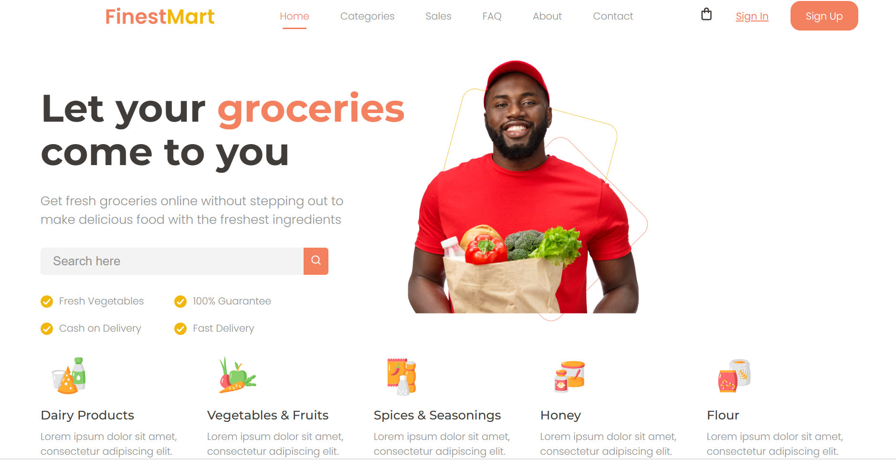

# Grocery Store Header

Este proyecto incluye un header para una página web de una tienda de comestibles, diseñado con HTML y CSS. El diseño es limpio y funcional, adecuado para una experiencia de usuario fluida.

    

    

  

## Estructura del Proyecto

El proyecto contiene los siguientes archivos:

- `index.html`: El archivo HTML principal que define la estructura de la página.
- `css/style.css`: El archivo CSS que contiene los estilos aplicados al HTML.
- `scss/`: Carpeta que incluye todos los archivos SCSS utilizados para generar el CSS.
- `img/`: Carpeta que contiene las imágenes utilizadas en el header.

## Instalación

1. Clona este repositorio o descarga los archivos.
2. Asegúrate de tener acceso a los archivos de imágenes en la carpeta `img/`.

## Uso

1. Abre `index.html` en tu navegador para ver el header en acción.
2. Si deseas modificar los estilos:
   - Puedes usar los archivos SCSS en la carpeta `scss/` y compilarlo a CSS utilizando un compilador de SASS.
   - También puedes editar directamente el archivo `css/style.css` para realizar cambios rápidos.

## Características

- **Responsive Design**: El header se adapta a diferentes tamaños de pantalla.
- **Navegación Intuitiva**: Incluye enlaces a las secciones principales de la tienda.
- **Acceso Rápido**: Botones de "Iniciar sesión" y "Registrarse" para facilitar el acceso a los usuarios.

## Licencia

Este proyecto está bajo la Licencia MIT. Consulta el archivo [LICENSE](LICENSE) para más detalles.

## Contribuir

Las contribuciones son bienvenidas. Si tienes alguna sugerencia o mejora, no dudes en abrir un issue o crear un pull request.

## Autor

- **Rosmén Valencia** - [PerfilGitHub](https://github.com/RosmenPro)

---

# Grocery Store Header

This project includes a header for a grocery store website, designed with HTML and CSS. The design is clean and functional, suitable for a smooth user experience.

## Project Structure

The project contains the following files:

- `index.html`: The main HTML file defining the page structure.
- `css/style.css`: The CSS file containing styles applied to the HTML.
- `scss/`: Folder that includes all SCSS files used to generate the CSS.
- `img/`: Folder containing images used in the header.

## Installation

1. Clone this repository or download the files.
2. Ensure you have access to the image files in the `img/` folder.

## Usage

1. Open `index.html` in your browser to view the header in action.
2. If you want to modify the styles:
   - You can use the SCSS files in the `scss/` folder and compile them to CSS using a SASS compiler.
   - You can also directly edit the `css/style.css` file for quick changes.

## Features

- **Responsive Design**: The header adapts to different screen sizes.
- **Intuitive Navigation**: Includes links to the main sections of the store.
- **Quick Access**: "Login" and "Sign Up" buttons to provide easy access for users.

## License

This project is under the MIT License. See the [LICENSE](LICENSE) file for more details.

## Contribute

Contributions are welcome. If you have any suggestions or improvements, feel free to open an issue or create a pull request.

## Author

- **Rosmén Valencia** - [GitHubProfile](https://github.com/RosmenPro)

